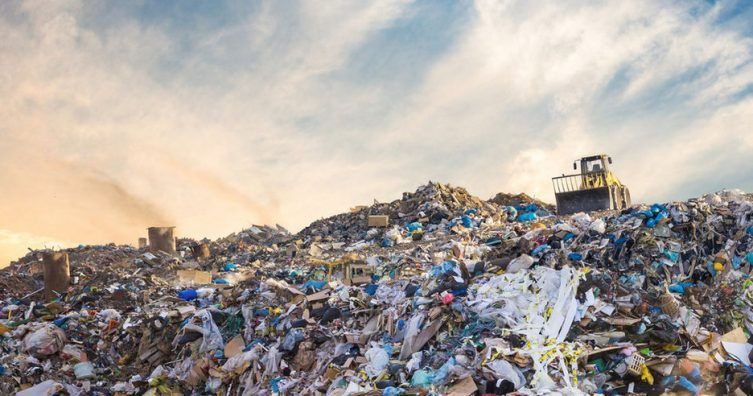

```{r message=FALSE, warning=FALSE, echo=FALSE}
path_residuos <-here::here("Generacion_residuos/generacion-de-residuos-solidos-urbanos-por-provincia.csv")

df_residuos <- read.csv(path_residuos,
         header = TRUE,
         sep = ";",
         encoding = "UTF-8")

```


```{r echo=FALSE}
path_gei <- here::here("Generacion_residuos/emisiones-gei-por-sector_dncc.csv")

df_gei <- read.csv(path_gei,
         header = TRUE,
         sep = ";",
         encoding = "UTF-8")
```

```{r echo=FALSE}
path_presup <- here::here("Generacion_residuos/presupuestos-asignados-para-construccion-obras.csv")

df_presup <- read.csv(path_presup,
         header = TRUE,
         sep = ";",
         encoding = "UTF-8")
```

```{r message=FALSE, warning=FALSE, echo=FALSE}
library(tidyverse)
library(rvest)
```

```{r include=FALSE}
web_gei <- read_html("https://www.argentina.gob.ar/ambiente/control/rsu", encoding = "UTF-8")

text_web_gei <- web_gei %>% html_nodes("p") %>% html_text()

print(text_web_gei[[2]])
print(text_web_gei[[3]])
print(text_web_gei[[4]])
```


<center>



</center>


Residuo es todo elemento, material, objeto o sustancia que, como consecuencia de los procesos de consumo y desarrollo de actividades humanas, es desechado o abandonado. Los residuos sólidos urbanos (RSU) son análogos a los denominados domiciliarios y pueden ser de origen residencial, urbano, comercial, asistencial, sanitario, industrial o institucional, con excepción de aquellos que se encuentren regulados por normas específicas.

La cantidad de RSU que generan (directa o indirectamente) los habitantes de un área refleja las condiciones de producción y consumo de la sociedad. Los residuos repercuten a largo plazo en la salud humana y el ambiente.

Cuando las instalaciones de recuperación y disposición final de RSU no cumplen con los requisitos mínimos de impermeabilidad de los suelos donde se emplazan, ni con las distancias a las napas freáticas, a los cursos de aguas superficiales, a los centros urbanos u otras áreas susceptibles de recibir los impactos derivados de estas instalaciones, se producen impactos negativos sobre el ambiente y la salud humana.[^1]


###Residuos Sólidos Urbanos[^2]


Existe consenso en que la generación creciente de residuos sólidos y la gestión inadecuada de los mismos constituyen uno de los grandes problemas ambientales de este siglo XXI. Si se indaga en las razones por las cuales los residuos sólidos se consideran un aspecto prioritario, seguramente se mencionen consideraciones como los basurales clandestinos a cielo abierto, la contaminación de acuíferos, ríos, playas y las costas, los malos olores, las condiciones sociales inaceptables de las personas que buscan en los residuos algún objeto aprovechable, o bien la proliferación de vectores de enfermedades como el Aedes aegypti.[^3]


```{r echo=FALSE}
df_rsu <- df_residuos %>% group_by(provincia_nombre) %>% 
  summarise(hab_total=sum(municipio_habitantes),
            residuos_hab_dia=mean(generacion_dia_habitante_Kg)) %>% 
  mutate(rsu_total_kg=hab_total*residuos_hab_dia)

df_rsu
```

La provincia de *Jujuy* cuenta con **468841** habitantes dentro de los municipios analizados; de los cuales, en promedio, cada uno genera **0.65 kg de RSU por día**. Dando un total diario de **302988.5 kg** de residuos.
Por otra parte, la constitución demográfica de la provincia de *Catamarca* para los 10 municipios es de **223574** habitantes, quienes producen **0.396 kg RSU/día**, lo que equivale a **88535.3 kg** totales para toda la provincia.


```{r message=FALSE, warning=FALSE, echo=FALSE}

fig1 <- df_rsu %>% ggplot2::ggplot()+
  geom_col(aes(x=provincia_nombre, y=rsu_total_kg/100, fill=provincia_nombre))+
   theme_minimal()+
  labs(title = "Cantidad de RSU diarios",
       x="",
       y="RSU (tn)")+
  scale_fill_manual(values=c("#8dd3c7", "#fdc086"))


fig1
```

```{r echo=FALSE}
planta_trasf <- df_residuos %>% group_by(provincia_nombre) %>% 
  count(con_planta_de_transferencia) %>% 
  rename(municipios=n)
planta_trasf$porcentaje <- c(porcentaje=c(100, 87.5, 12.5))

planta_trasf
```


Los residuos sólidos están constituidos por una mezcla heterogénea de materiales, dentro de los cuales se encuentran residuos biodegradables u orgánicos, papel, cartón, plástico, vidrio, metales, entre otros. En el caso particular de los residuos sólidos domiciliarios, el material biodegradable constituye cerca del 50% de todos los residuos, medidos con base en su peso.[^3]

A los efectos de calentamiento global, el problema lo constituye precisamente este alto porcentaje de material biodegradable, principalmente por su falta de aprovechamiento y mala gestión.

El proceso de descomposición de los residuos orgánicos emite una serie de gases de efecto invernadero, en especial metano.

El Gobierno argentino elaboró la Estrategia Nacional para la Gestión Integral de Residuos Sólidos Urbanos (ENGIRSU), en el año 2005, como eje para llevar a cabo una política pública ambiental, aspirando a que la misma fuese implementada en todo el país, en fases de corto, mediano y largo plazo, dentro de un horizonte temporal establecido en veinte años (2006 – 2025).

La Estrategia está basada en el criterio de integralidad (reducción en origen, separación domiciliaria, recolección y transporte, transferencia y regionalización), procesamiento (reciclado de inorgánicos, compostaje de orgánico y otros) y Centros de Disposición Final (CDF).[^4]


Para las provincias analizadas se asignó un presupuesto para la *_construcción de relleno sanitario_*, *_playón de compostaje_* y *_planta de transferencia_*.[^5]

```{r echo=FALSE}
print(df_presup %>% select(provincia_nombre, obra_denominacion, obra_fecha_inicio,obra_poblacion_alcanzada))
```

Por lo tanto:

Provincia | Habitantes | Alcance de obra/hab
---|---|---
Jujuy | 468841 | 468841
Catamarca | 223574 | 223574

Las obras llegarían a cubrir a la población de los municipios considerados.


###Gases de efecto invernadero[^6]


Los GEI, como su nombre lo indica, contribuyen a atrapar el calor generado por los rayos solares en la atmósfera, a manera de un gran invernadero atmosférico. Si bien los GEI son componentes naturales y fundamentales de la atmósfera, el problema reside en la elevada concentración de los mismos. Como opinión casi consensuada de la comunidad científica mundial, la emisión antropogénica (inherente a actividades propias de los seres humanos) de GEI es la principal responsable del calentamiento global.

No todos los GEI tienen la misma capacidad para atrapar los rayos ultravioleta, por lo cual se ha establecido un índice llamado Potencial de Calentamiento Global (PCG), el cual mide de manera relativa cuánto calor puede ser atrapado por un determinado GEI, en comparación con el dióxido de carbono. El PCG puede ser calculado para diferentes horizontes de tiempo, siendo 100 años el valor más frecuente.

Según el IPCC (2007), el metano, principal GEI emitido en el proceso de descomposición del material biodegradable, tiene un PCG a 100 años de 25. En otras palabras, la emisión de una tonelada de metano a la atmósfera es equivalente a emitir 25 toneladas de dióxido de carbono, lo cual hace aún más evidente la relevancia que tiene el sector de los residuos en la lucha para reducir el calentamiento global.[^3]

De la base de datos consultada, observamos que la evolución total de los GEI es:

```{r include=FALSE}
ev_gei <- df_gei %>% group_by(emisiones_gei_anio) %>% 
  summarise(Emisiones_GEI_total=sum(emisiones_gei)) %>% 
  rename(Periodo=emisiones_gei_anio)
  
```


```{r echo=FALSE}
gei_comparacion <- df_gei %>% filter(emisiones_gei_sector=="Residuos") %>% 
  select(emisiones_gei_anio, emisiones_gei) %>% 
  rename(Periodo=emisiones_gei_anio) %>% 
  inner_join(ev_gei, by="Periodo") %>% 
  mutate(incidencia=emisiones_gei*100/Emisiones_GEI_total)

gei_comparacion
```

Se puede observar que la incidencia de las residuos (*emisiones_gei*) en la generación de gases de efecto invernadero es de 3-4% del total (*Emisiones_GEI_total*) generado por los demás sectores (agropecuario, energía e industria)

```{r echo=FALSE}
fig2 <- ggplot2::ggplot(gei_comparacion, aes(x=Periodo, y=Emisiones_GEI_total))+
  geom_col(fill="orange")+
  theme_light()+
  labs(title = "Evolución de los GEI totales",
       subtitle = "Sector agropecuario, industrial, enrgético y de residuos",
       x="",
       y="GEI (MegaTn CO2 eq)")

fig2

```

```{r echo=FALSE}
fig3 <- ggplot2::ggplot(gei_comparacion,aes(x=Periodo))+
  geom_line(aes(y=emisiones_gei, color="Residuos"))+
  geom_line(aes(y=Emisiones_GEI_total, color="Total"))+
  theme_light()+
  labs(title="Comparación de emisones de GEI",
       subtitle = "Totales y de RSU",
       x="Periodo",
       y="GEI")

fig3
```


No obstante, los GEI generados por los RSU ha ido incrementando con el tiempo.

```{r echo=FALSE}
plot_ev_gei <- plotly::plot_ly(df_gei %>% filter(emisiones_gei_sector=="Residuos"),
                x=~emisiones_gei_anio,
                y=~emisiones_gei,
                type = "scatter",
                mode= "markers",
                size = ~emisiones_gei*5,
                frame = ~emisiones_gei_anio) %>% 
  plotly::layout(title=list(text="Evolución de la emisión de GEI por los Residuos"),
                 xaxis=list(text="Periodo"),
                 yaxis=list(text="GEI (MegaTn CO2 eq)"))

plot_ev_gei

```


                                  Agro Analytics


[^1] [Ambiente](https://www.argentina.gob.ar/ambiente/control/rsu)
[^2] [Datos RSU](https://datos.gob.ar/dataset/ambiente-generacion-residuos)
[^3] [RSU MDQ](https://www.mardelplata.gob.ar/Contenido/residuos-y-cambio-clim%C3%A1tico)
[^4] [ARG Ambiente](https://www.argentina.gob.ar/ambiente/control/estrategia-nacional)
[^5] [Datos Presupuestos](https://datos.gob.ar/dataset/ambiente-asignacion-presupuestaria-para-construccion-obras-para-tratamientos-residuos)
[^6] [Datos GEI](https://datos.gob.ar/dataset/ambiente-emisiones-gases-efecto-invernadero-gei)
